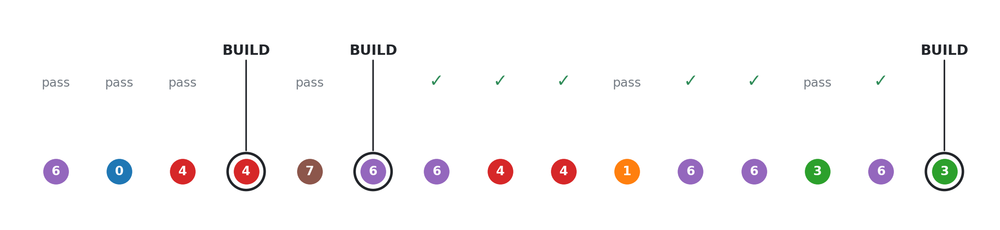
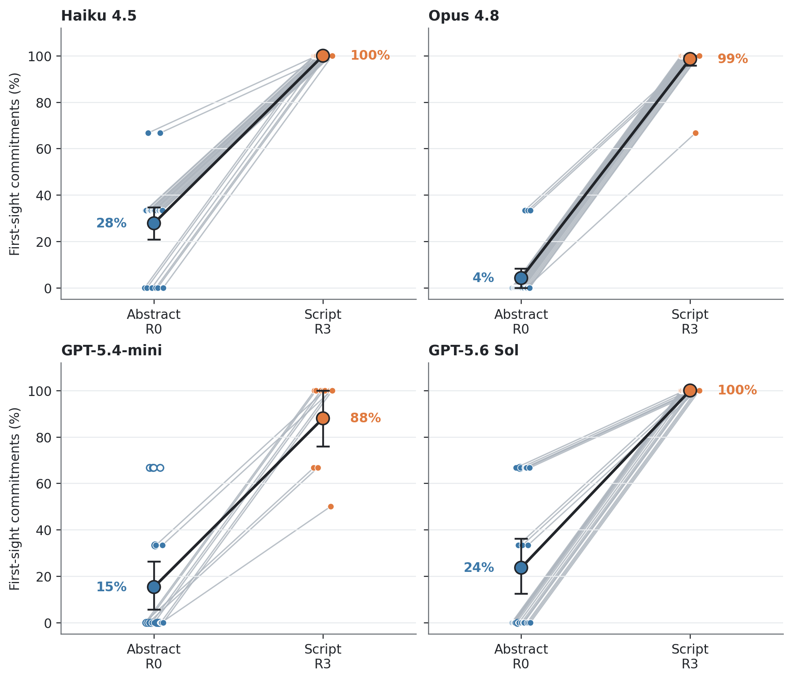
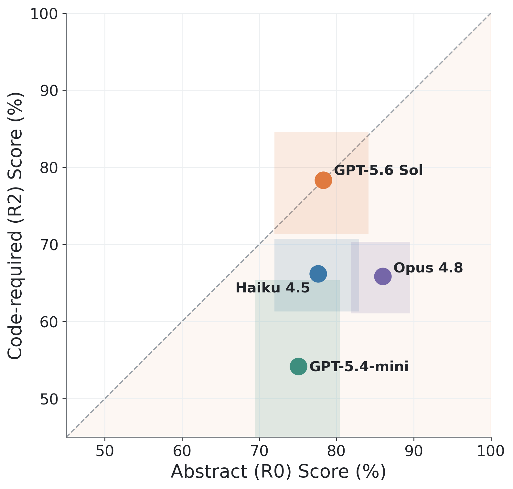
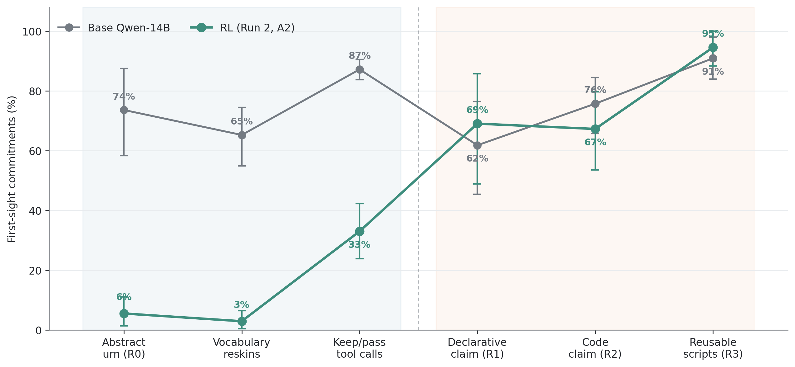
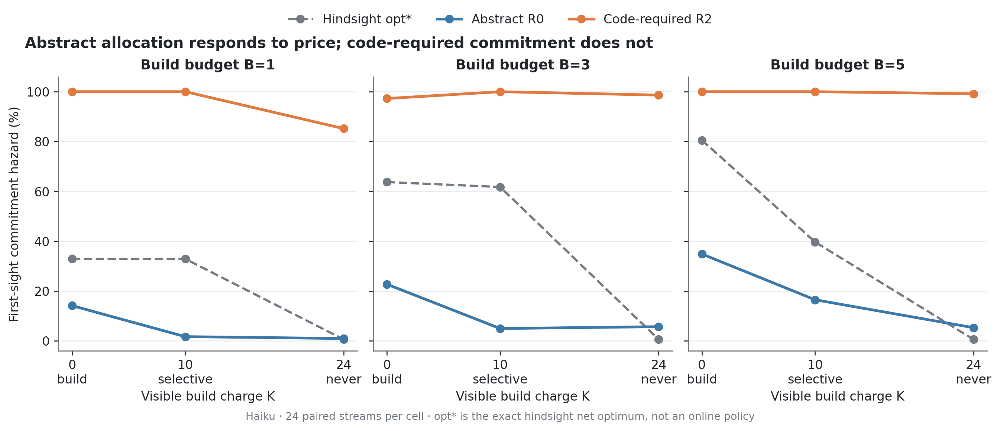
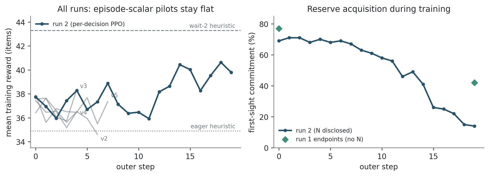

# AllocBench

**Measuring Online Tool Allocation Capability in LLM Agents**

<p align="left">
  <a href="https://arxiv.org/abs/2607.23332"></a>
  
  
  
</p>

📄 **Paper:** [arXiv:2607.23332](https://arxiv.org/abs/2607.23332)

Creating a reusable tool is an *investment*: an agent pays a fixed cost now in exchange for
the possibility of future reuse. A capable agent should therefore build a small number of
highly reusable tools rather than many one-offs. **AllocBench** is a paired benchmark that
measures whether LLM agents actually make this allocation decision well under a fixed budget,
in two matched contexts: an **abstract** text formulation and a **code-construction** task.

Our headline finding: every frontier model we test — **Claude Haiku, Claude Opus, GPT-5.4-mini,
and GPT-5.6 Sol** — allocates near-optimally in the abstract framing but **fails to transfer
that ability to script-writing**. An open-source Qwen model policy-trained for abstract
allocation generalizes across held-out lexical variations, yet still sees no improvement at
script allocation. Together these results establish online tool allocation as a real capability
boundary for modern frontier models.

> This repository is a standalone extract of the paper, its evaluation harness, and its result
> artifacts, pulled out of a larger multi-project research repo. It contains everything needed
> to read the paper, regenerate its figures and tables from the stored run data, and re-run the
> benchmark end to end.

## Key findings

- **A framing dissociation, universal at full construction.** Every frontier model is selective
  and near-optimal in the abstract keep/pass task (R0) but commits eagerly — near 100% at first
  sight — once the same decision is posed as writing a reusable script (R3).
- **The gap is not about code correctness.** Three of four models fail even when the scripts are
  never executed or evaluated; the failure is in the *when-to-build* decision, not in coding.
- **Price inelasticity.** Abstract allocation responds to a visible build charge (models grow
  more selective as building gets expensive); code-required allocation stays pinned near 100%
  commitment across the entire price surface.
- **Learned allocation transfers laterally, not across framing.** A Qwen checkpoint RL-trained on
  the abstract task generalizes to held-out lexical reskins of that task, but shows no transfer
  to the script-writing framing.

## Figures

| | | |
|---|---|---|
|  |  |  |
| **Fig 1** — the optimal policy | **Fig 2** — R0→R3 dissociation | **Fig 3** — R0 vs. R2 capability map |
|  |  |  |
| **Fig 4** — RL transfer boundary | **Fig 5** — economic elasticity | **Fig 6** — RL training curves |

## The framing ladder

The benchmark's core is a four-rung ladder that holds the underlying allocation decision fixed
while changing only its *surface framing*:

| Rung | Module | Framing |
|------|--------|---------|
| **R0** | `scripts.ladder.urn_session` | Abstract keep/pass decision, free text |
| **R1** | `scripts.ladder.urn_tool_session` | Same decision expressed via tool calls |
| **R2** | `scripts.ladder.claim_solver_session` | Declarative "I can solve this class" claim, no code |
| **R2c** | `scripts.ladder.claim_solver_code_session` | Code-required claim (correctness not rewarded) |
| **R3** | `scripts.ladder.arm_a1_announce` | Full reusable-script harness: write / run / answer |

## Repository layout

```
tool-investment.tex   the paper
allocation.bib        its bibliography (\bibliography{allocation})
figs/                 the six paper figures (.pdf + .png)
runs/                 stored per-seed transcripts, configs, and analysis JSON
scripts/              the benchmark harness, analysis, plotting, and RL code
requirements.txt
```

### `scripts/`

| Package | Contents |
|---------|----------|
| `scripts/ladder/` | The four framing-ladder rungs (R0–R3) plus shared urn/episode primitives (`urn_common.py`). |
| `scripts/session/` | Harness internals: the multi-provider chat client (`raw_chat.py`), stream generation (`stream_builder.py`), the R3 script driver (`driver.py`, `session_state.py`, `prompts.py`), sandboxed execution (`sandbox_exec.py`), scoring (`skirental_scorer.py`), and grading. |
| `scripts/theory/` | Reference policies and comparators: the exact hindsight net-optimum (`exact_dp.py`, `pi_star.py`) and the numeric problem families (`family_kit.py`). |
| `scripts/economic/` | The economic `(B, K)` response-surface machinery (`economic_surface.py`) and its driver (`run_economic_surface.py`). |
| `scripts/analysis/` | Per-arm analysis: economic surface, GPT R0/R2c, and the corrected class-bound R3 script-transfer numbers. |
| `scripts/plotters/` | One script per figure (`plot_fig1.py` … `plot_fig6.py`), each writing `figs/figN_*.{png,pdf}` from `runs/`. Shared style/data helpers in `_common.py`. |
| `scripts/rl/` | The QLoRA + per-decision PPO training pipeline for the Qwen reward-learning case study. |

### `runs/`

Stored per-seed session transcripts, configs, and analysis JSON for every arm the paper cites.
Naming follows the harness: `urn_*` = R0, `urn_tool_*` = R1, `claim_solver_*` = R2,
`claim_solver_code_*` = R2c, `arm_a1_announce_*` = R3, `economic_surface_*` = the `(B,K)` sweep.
Suffixes mark protocol variants — e.g. `_n-announced` = the disclosed-`N` condition (the paper's
primary condition), `_class-bound-v1` = the corrected write-budget-attribution protocol, `_efr4`
= four empty-fence retries (the Qwen idle-tail mitigation), and `_vocab-*` = the lexical-reskin
generalization probes.

## Installation

```bash
pip install -r requirements.txt
```

Provider access is configured through environment variables (a `.env` file is loaded
automatically):

| Provider | Variables |
|----------|-----------|
| Anthropic (Claude) | `ANTHROPIC_API_KEY` |
| OpenAI (GPT) | `OPENAI_API_KEY` |
| Google (Gemini) | `GEMINI_API_KEY` |
| Local open-weights (Ollama / vLLM) | `OLLAMA_BASE_URL`, `OLLAMA_API_KEY`, or `VLLM_BASE_URL`; set `LOCAL_BACKEND=vllm` to route to vLLM |

Models are selected by string. Short aliases resolve to pinned IDs (`haiku`, `sonnet`, `opus`);
GPT and local models are passed by their full names. The provider is inferred from the model
string automatically.

## Reproducing the core results

From the repo root, with `PYTHONPATH=.`, run the five framing-ladder rungs and the economic
sweep (Haiku shown; swap `--model` for `opus`, a GPT id, or a local Qwen tag):

```bash
PYTHONPATH=. python -u -m scripts.ladder.urn_session \
  --model haiku --announce-n --seeds $(seq 2000 2023)
PYTHONPATH=. python -u -m scripts.ladder.urn_tool_session \
  --model haiku --announce-n --seeds $(seq 2000 2023)
PYTHONPATH=. python -u -m scripts.ladder.claim_solver_session \
  --model haiku --announce-n --seeds $(seq 2000 2023)
PYTHONPATH=. python -u -m scripts.ladder.claim_solver_code_session \
  --model haiku --announce-n --seeds $(seq 2000 2023)
PYTHONPATH=. python -u -m scripts.ladder.arm_a1_announce \
  --model haiku --announce-n --full-stream --seeds $(seq 2000 2023) --cap 20.0 --unit-cap 2.0
PYTHONPATH=. python -u -m scripts.economic.run_economic_surface \
  --seeds $(seq 2000 2023)
PYTHONPATH=. python -u -m scripts.analysis.analyze_economic_surface \
  --seeds $(seq 2000 2023) --charges 0 10 20 24
```

Then regenerate every figure from the stored run data:

```bash
for n in 1 2 3 4 5 6; do python scripts/plotters/plot_fig$n.py; done
```

See `tool-investment.tex`'s "Commands and Artifact Manifest" appendix for the complete command
set, including the Opus, GPT, and Qwen arms and the exact protocol behind each cell.

## Compiling the paper

The published version is on arXiv ([abs](https://arxiv.org/abs/2607.23332) ·
[pdf](https://arxiv.org/pdf/2607.23332)); `tool-investment.tex` here is the source it was built
from. To compile it yourself: `tool-investment.tex` `\input`s `math_commands.tex` and `\usepackage`s an ICLR conference class;
these come from an external LaTeX template and are **not vendored** here. Supply them (or
substitute your own conference class) before compiling.

## Citation

```bibtex
@misc{allocbench,
  title         = {AllocBench: Measuring Online Tool Allocation Capability in LLM Agents},
  author        = {Wang, Daniel and Xu, Andrew},
  year          = {2026},
  eprint        = {2607.23332},
  archivePrefix = {arXiv},
  primaryClass  = {cs.LG},
  url           = {https://arxiv.org/abs/2607.23332}
}
```

## License

Released under the [MIT License](LICENSE).
